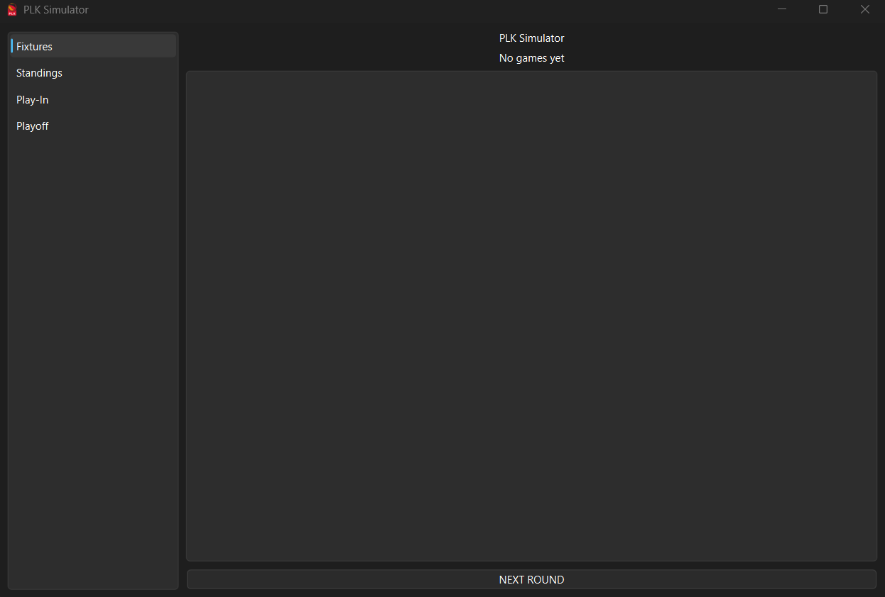
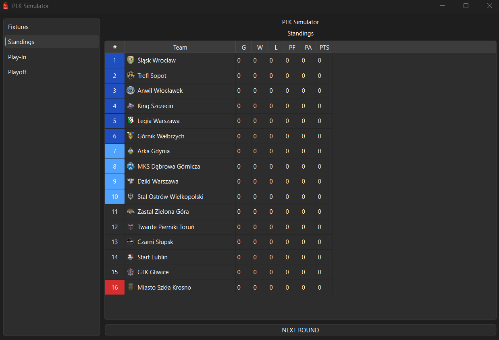
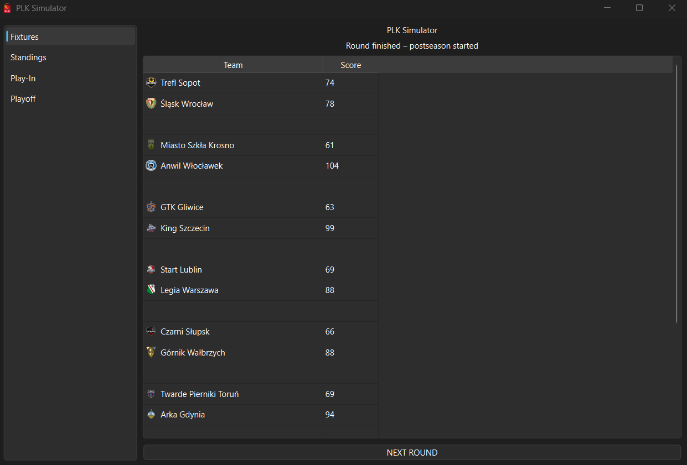
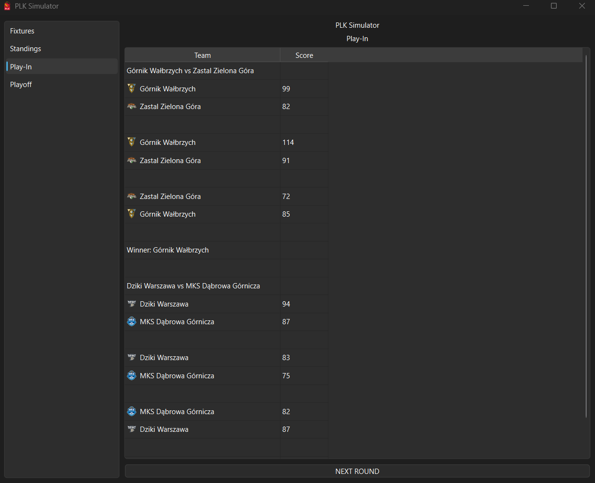
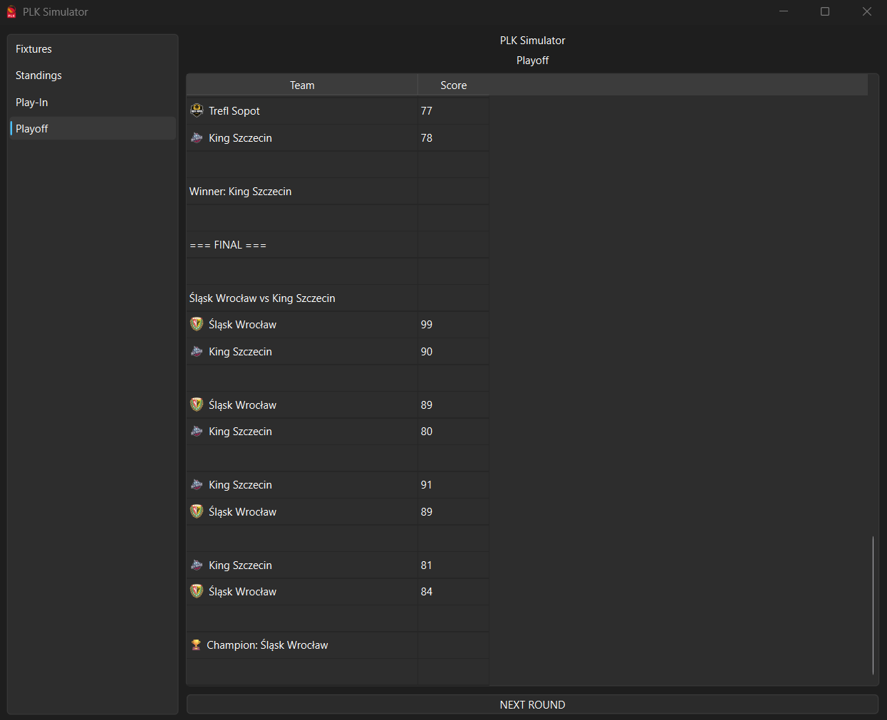

# PLK Simulator

Basketball league simulator built in Python with a graphical interface.

## Features
- Full regular season simulation
- Play-In tournament (7–10 seeds)
- Playoffs (Quarterfinals, Semifinals, Final)
- Best-of-5 series with home/away logic
- Standings tracking
- Game-by-game simulation engine
- GUI built with PySide6

## How It Works
- Teams are loaded from a JSON file
- Schedule is generated automatically
- Each round is simulated step-by-step
- After regular season, Play-In and Playoffs are simulated

## Tech Stack
- Python
- PySide6 (GUI)

## Installation
pip install -r requirements.txt

## Run
python gui.py

## Project Structure
- engine.py – game simulation logic
- gui.py – main application UI
- main.py – orchestration and postseason logic
- league.py – standings system
- models.py – data models
- schedule.py – fixture generator
- data/teams.json – teams configuration

## Screenshots

## Main Window

## Standings

## Round Finished

## Play Ins

## Play Offs

## Notes
This is a simulation project focused on logic and structure rather than realism.
